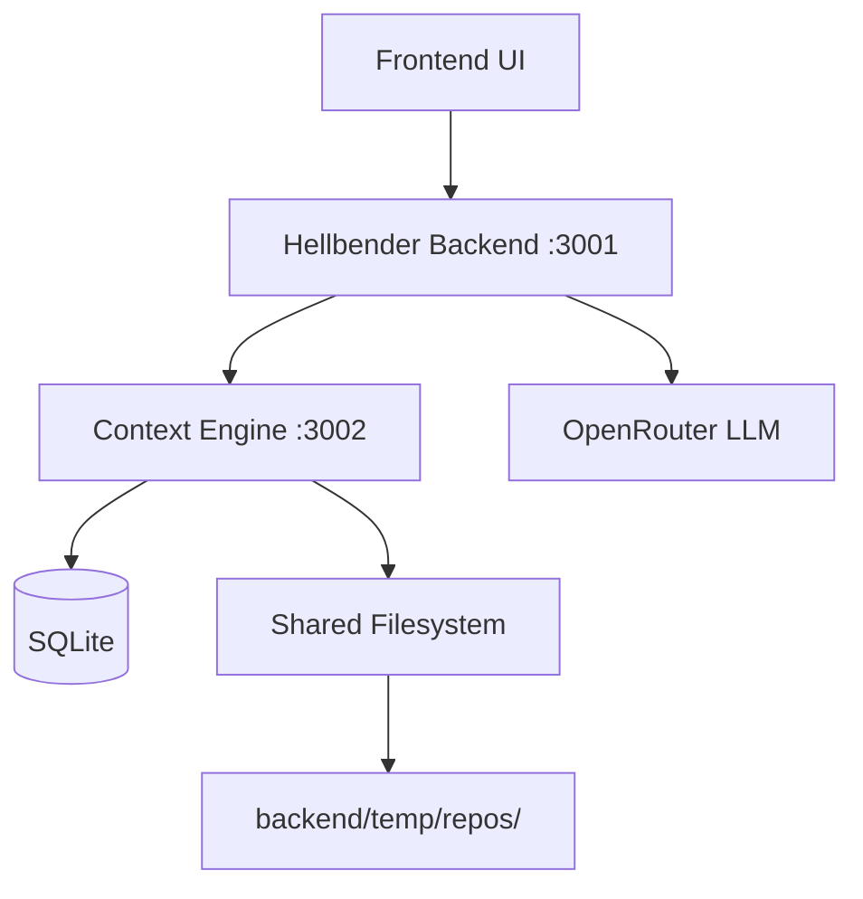

# Hellbender → Context Engine Roadmap

> **Purpose**: Transform Hellbender from "LLM reviewing files" into a repo-aware, context-engineered code agent.

---

## About This Project

**This is a learning-first, production-ready project.**

I'm a student building this to understand how modern AI code tools (like Cursor, Copilot, Cody) actually work under the hood. The goal is to learn by building—not just use AI tools, but understand the engineering that makes them smart.

At the same time, this isn't a toy. I want Hellbender to be reliable enough for me and my coworkers to use on real codebases. So every component is designed with production quality in mind: proper error handling, incremental indexing, structured logging, and testable architecture.

### What You'll Learn Building This

| Concept | Why It Matters | Where You'll See It |
|---------|----------------|---------------------|
| **AST Parsing** | How code editors understand structure, not just text | Tree-sitter integration (Task 2) |
| **Embeddings & Vector Search** | How semantic search finds "similar" code by meaning | Embeddings module (Task 4) |
| **Graph Databases** | How to model relationships (imports, dependencies) | SQLite dependency tables (Task 2-3) |
| **Retrieval-Augmented Generation (RAG)** | How LLMs get context they weren't trained on | Retrieval engine (Task 5) |
| **Token Budgeting** | Why LLMs have limits and how to work within them | Context packer (Task 6) |
| **Multi-pass LLM Orchestration** | How to break complex tasks into focused subtasks | Review orchestrator (Task 7) |
| **Service Architecture** | How to split a system into cooperating services | Backend + Context Engine separation |

### Learning Tips

1. **Read the "Why" comments** — I've added explanations throughout the code snippets
2. **Run each task's acceptance test** — Seeing it work builds intuition
3. **Inspect the SQLite database** — Use `sqlite3` CLI to explore what got stored
4. **Add console.logs liberally** — Trace the data flow through the system
5. **Break things on purpose** — See what error handling catches (and what it doesn't)

### Production Quality Checklist

Every task should meet these standards before moving on:

- [ ] Handles errors gracefully (no crashes on bad input)
- [ ] Logs enough to debug issues in production
- [ ] Validates inputs at service boundaries
- [ ] Has at least one acceptance test that proves it works
- [ ] Doesn't block the main thread for long operations

---

## Architecture Overview



**Key principle**: Frontend NEVER decides context. Backend ALWAYS controls what the LLM sees.

---

## Service Boundaries

| Component | Role | Port |
|-----------|------|------|
| `frontend/` | Display-only UI | 5173 |
| `backend/` | Control plane, orchestration | 3001 |
| `context-engine/` | Indexing, retrieval, context packing | 3002 |

---

## SQLite Schema (implement in Week 1)

Create `context-engine/src/db/schema.sql`:

```sql
-- Tracks indexed repositories
CREATE TABLE IF NOT EXISTS repos (
  repo_id TEXT PRIMARY KEY,
  root_path TEXT NOT NULL,
  indexed_at TEXT NOT NULL,
  head_sha TEXT,
  branch TEXT,
  tool_version TEXT DEFAULT '1.0.0'
);

-- Tracks individual files and their content hashes for incremental indexing
CREATE TABLE IF NOT EXISTS files (
  id INTEGER PRIMARY KEY AUTOINCREMENT,
  repo_id TEXT NOT NULL,
  path TEXT NOT NULL,
  language TEXT,
  sha256 TEXT NOT NULL,
  size INTEGER,
  last_indexed_at TEXT NOT NULL,
  UNIQUE(repo_id, path),
  FOREIGN KEY (repo_id) REFERENCES repos(repo_id) ON DELETE CASCADE
);

-- Extracted symbols (functions, classes, interfaces, etc.)
CREATE TABLE IF NOT EXISTS symbols (
  id INTEGER PRIMARY KEY AUTOINCREMENT,
  repo_id TEXT NOT NULL,
  name TEXT NOT NULL,
  type TEXT NOT NULL CHECK(type IN ('function', 'class', 'interface', 'type', 'variable', 'export')),
  file TEXT NOT NULL,
  start_line INTEGER NOT NULL,
  end_line INTEGER NOT NULL,
  start_byte INTEGER,
  end_byte INTEGER,
  signature_json TEXT,
  FOREIGN KEY (repo_id) REFERENCES repos(repo_id) ON DELETE CASCADE
);
CREATE INDEX idx_symbols_repo_name ON symbols(repo_id, name);
CREATE INDEX idx_symbols_repo_file ON symbols(repo_id, file);

-- Import/export dependency graph
CREATE TABLE IF NOT EXISTS dependencies (
  id INTEGER PRIMARY KEY AUTOINCREMENT,
  repo_id TEXT NOT NULL,
  file TEXT NOT NULL,
  imported_file TEXT NOT NULL,
  import_kind TEXT CHECK(import_kind IN ('import', 'require', 'dynamic')),
  import_symbol TEXT,
  resolved_path TEXT,
  FOREIGN KEY (repo_id) REFERENCES repos(repo_id) ON DELETE CASCADE
);
CREATE INDEX idx_deps_repo_file ON dependencies(repo_id, file);
CREATE INDEX idx_deps_repo_imported ON dependencies(repo_id, imported_file);

-- Code chunks for retrieval
CREATE TABLE IF NOT EXISTS chunks (
  chunk_id TEXT PRIMARY KEY,
  repo_id TEXT NOT NULL,
  file TEXT NOT NULL,
  symbol_id INTEGER,
  type TEXT NOT NULL CHECK(type IN ('function', 'class', 'interface', 'top_level', 'block')),
  start_line INTEGER NOT NULL,
  end_line INTEGER NOT NULL,
  code TEXT NOT NULL,
  hash TEXT NOT NULL,
  FOREIGN KEY (repo_id) REFERENCES repos(repo_id) ON DELETE CASCADE,
  FOREIGN KEY (symbol_id) REFERENCES symbols(id) ON DELETE SET NULL
);
CREATE INDEX idx_chunks_repo_file ON chunks(repo_id, file);

-- Embeddings (Week 2)
CREATE TABLE IF NOT EXISTS embeddings (
  chunk_id TEXT PRIMARY KEY,
  repo_id TEXT NOT NULL,
  model TEXT NOT NULL,
  dims INTEGER NOT NULL,
  vector_json TEXT NOT NULL,
  FOREIGN KEY (chunk_id) REFERENCES chunks(chunk_id) ON DELETE CASCADE
);

-- Review memory (Week 6)
CREATE TABLE IF NOT EXISTS review_memory (
  id INTEGER PRIMARY KEY AUTOINCREMENT,
  repo_id TEXT NOT NULL,
  file TEXT NOT NULL,
  risk_score REAL,
  last_review_at TEXT,
  feedback_json TEXT,
  FOREIGN KEY (repo_id) REFERENCES repos(repo_id) ON DELETE CASCADE
);
```

---

## TASK 1: Bootstrap Context Engine Service

**Goal**: Create a new Node/TypeScript service at `context-engine/` with Express, config, logging, and a health endpoint.

### Step 1.1: Initialize the package

```bash
# From project root
mkdir -p context-engine/src/{routes,indexing,chunking,db,retrieval,packing,config,utils}
cd context-engine
npm init -y
npm install express cors dotenv better-sqlite3 tree-sitter tree-sitter-typescript tree-sitter-javascript uuid
npm install -D typescript @types/node @types/express @types/cors @types/better-sqlite3 @types/uuid ts-node nodemon
```

### Step 1.2: Create `context-engine/tsconfig.json`

```json
{
  "compilerOptions": {
    "target": "ES2022",
    "module": "commonjs",
    "lib": ["ES2022"],
    "outDir": "./dist",
    "rootDir": "./src",
    "strict": true,
    "esModuleInterop": true,
    "skipLibCheck": true,
    "forceConsistentCasingInFileNames": true,
    "resolveJsonModule": true,
    "declaration": true
  },
  "include": ["src/**/*"],
  "exclude": ["node_modules", "dist"]
}
```

### Step 1.3: Create `context-engine/src/config/environment.ts`

```typescript
import 'dotenv/config';

export const config = {
  port: parseInt(process.env.CONTEXT_ENGINE_PORT || '3002', 10),
  reposBasePath: process.env.REPOS_BASE_PATH || '../backend/temp/repos',
  openRouterApiKey: process.env.OPENROUTER_API_KEY,
  dbPath: process.env.DB_PATH || './data/context.db',
  logLevel: process.env.LOG_LEVEL || 'info',
};

export function validateEnvironment(): void {
  if (!config.openRouterApiKey) {
    console.warn('OPENROUTER_API_KEY not set - embeddings will fail');
  }
}
```

### Step 1.4: Create `context-engine/src/db/sqlite.ts`

```typescript
import Database from 'better-sqlite3';
import * as fs from 'fs';
import * as path from 'path';
import { config } from '../config/environment';

let db: Database.Database | null = null;

export function getDb(): Database.Database {
  if (!db) {
    // Ensure data directory exists
    const dbDir = path.dirname(config.dbPath);
    if (!fs.existsSync(dbDir)) {
      fs.mkdirSync(dbDir, { recursive: true });
    }
    
    db = new Database(config.dbPath);
    db.pragma('journal_mode = WAL');
    db.pragma('foreign_keys = ON');
    
    // Initialize schema
    const schemaPath = path.join(__dirname, 'schema.sql');
    const schema = fs.readFileSync(schemaPath, 'utf-8');
    db.exec(schema);
  }
  return db;
}

export function closeDb(): void {
  if (db) {
    db.close();
    db = null;
  }
}
```

### Step 1.5: Create `context-engine/src/utils/pathValidator.ts`

```typescript
import * as path from 'path';
import * as fs from 'fs';
import { config } from '../config/environment';

/**
 * Validates and resolves a repoId to a safe filesystem path.
 * Returns null if the path is invalid or attempts traversal.
 */
export function resolveRepoPath(repoId: string): string | null {
  // repoId must be a valid UUID format
  const uuidRegex = /^[0-9a-f]{8}-[0-9a-f]{4}-[0-9a-f]{4}-[0-9a-f]{4}-[0-9a-f]{12}$/i;
  if (!uuidRegex.test(repoId)) {
    return null;
  }

  const basePath = path.resolve(config.reposBasePath);
  const repoPath = path.resolve(basePath, repoId);

  // Ensure resolved path is within basePath (prevent traversal)
  if (!repoPath.startsWith(basePath + path.sep)) {
    return null;
  }

  // Check if path exists
  if (!fs.existsSync(repoPath)) {
    return null;
  }

  return repoPath;
}

/**
 * Validates a file path within a repo to prevent traversal.
 */
export function validateFilePath(filePath: string, repoPath: string): string | null {
  const resolved = path.resolve(repoPath, filePath);
  if (!resolved.startsWith(repoPath + path.sep) && resolved !== repoPath) {
    return null;
  }
  return resolved;
}
```

### Step 1.6: Create `context-engine/src/server.ts`

```typescript
import 'dotenv/config';
import express, { Request, Response, NextFunction } from 'express';
import cors from 'cors';
import { config, validateEnvironment } from './config/environment';
import { getDb, closeDb } from './db/sqlite';

validateEnvironment();

const app = express();

app.use(cors());
app.use(express.json({ limit: '50mb' }));

// Request logging middleware
app.use((req: Request, res: Response, next: NextFunction) => {
  const start = Date.now();
  res.on('finish', () => {
    const duration = Date.now() - start;
    console.log(`[${new Date().toISOString()}] ${req.method} ${req.path} ${res.statusCode} ${duration}ms`);
  });
  next();
});

// Health check
app.get('/health', (req: Request, res: Response) => {
  try {
    const db = getDb();
    db.prepare('SELECT 1').get();
    res.json({ status: 'ok', service: 'context-engine' });
  } catch (error) {
    res.status(500).json({ status: 'error', error: (error as Error).message });
  }
});

// TODO: Mount routes here as they are implemented
// app.use('/context', indexRepoRoutes);
// app.use('/context', retrieveRoutes);
// app.use('/context', reviewRoutes);

// Error handling middleware
app.use((err: Error, req: Request, res: Response, next: NextFunction) => {
  console.error('[ERROR]', err);
  res.status(500).json({ error: 'Internal server error', message: err.message });
});

// Graceful shutdown
process.on('SIGTERM', () => {
  console.log('SIGTERM received, closing database...');
  closeDb();
  process.exit(0);
});

app.listen(config.port, () => {
  console.log(`Context Engine running on http://localhost:${config.port}`);
  // Initialize DB on startup
  getDb();
});

export default app;
```

### Step 1.7: Update `context-engine/package.json` scripts

```json
{
  "scripts": {
    "dev": "nodemon --exec ts-node src/server.ts",
    "build": "tsc",
    "start": "node dist/server.js"
  }
}
```

### Acceptance Test for Task 1

```bash
cd context-engine
npm run dev
# In another terminal:
curl http://localhost:3002/health
# Expected: {"status":"ok","service":"context-engine"}
```

---

## TASK 2: Tree-sitter Symbol Extraction

**Goal**: Parse TypeScript/JavaScript files and extract functions, classes, interfaces, imports/exports into the `symbols` and `dependencies` tables.

### Step 2.1: Create `context-engine/src/indexing/treeSitter.ts`

```typescript
import Parser from 'tree-sitter';
import TypeScript from 'tree-sitter-typescript';
import JavaScript from 'tree-sitter-javascript';

const tsParser = new Parser();
tsParser.setLanguage(TypeScript.typescript);

const tsxParser = new Parser();
tsxParser.setLanguage(TypeScript.tsx);

const jsParser = new Parser();
jsParser.setLanguage(JavaScript);

export function getParser(language: string): Parser | null {
  switch (language) {
    case 'typescript':
    case 'ts':
      return tsParser;
    case 'tsx':
      return tsxParser;
    case 'javascript':
    case 'js':
    case 'jsx':
      return jsParser;
    default:
      return null;
  }
}

export function getLanguageFromPath(filePath: string): string | null {
  const ext = filePath.split('.').pop()?.toLowerCase();
  switch (ext) {
    case 'ts':
      return 'typescript';
    case 'tsx':
      return 'tsx';
    case 'js':
    case 'mjs':
    case 'cjs':
      return 'javascript';
    case 'jsx':
      return 'jsx';
    default:
      return null;
  }
}

export { Parser };
```

### Step 2.2: Create `context-engine/src/indexing/extractSymbols.ts`

```typescript
import { getParser, getLanguageFromPath, Parser } from './treeSitter';
import type { SyntaxNode } from 'tree-sitter';

export interface ExtractedSymbol {
  name: string;
  type: 'function' | 'class' | 'interface' | 'type' | 'variable' | 'export';
  startLine: number;
  endLine: number;
  startByte: number;
  endByte: number;
  signature?: string;
}

export interface ExtractedDependency {
  importedFile: string;
  importKind: 'import' | 'require' | 'dynamic';
  importSymbol?: string;
}

export interface ExtractionResult {
  symbols: ExtractedSymbol[];
  dependencies: ExtractedDependency[];
}

export function extractFromFile(filePath: string, content: string): ExtractionResult | null {
  const language = getLanguageFromPath(filePath);
  if (!language) return null;

  const parser = getParser(language);
  if (!parser) return null;

  const tree = parser.parse(content);
  const symbols: ExtractedSymbol[] = [];
  const dependencies: ExtractedDependency[] = [];

  function visit(node: SyntaxNode): void {
    // Extract function declarations
    if (node.type === 'function_declaration' || node.type === 'method_definition') {
      const nameNode = node.childForFieldName('name');
      if (nameNode) {
        symbols.push({
          name: nameNode.text,
          type: 'function',
          startLine: node.startPosition.row + 1,
          endLine: node.endPosition.row + 1,
          startByte: node.startIndex,
          endByte: node.endIndex,
          signature: getSignature(node, content),
        });
      }
    }

    // Extract arrow functions assigned to variables
    if (node.type === 'lexical_declaration' || node.type === 'variable_declaration') {
      for (const declarator of node.namedChildren) {
        if (declarator.type === 'variable_declarator') {
          const nameNode = declarator.childForFieldName('name');
          const valueNode = declarator.childForFieldName('value');
          if (nameNode && valueNode && valueNode.type === 'arrow_function') {
            symbols.push({
              name: nameNode.text,
              type: 'function',
              startLine: node.startPosition.row + 1,
              endLine: node.endPosition.row + 1,
              startByte: node.startIndex,
              endByte: node.endIndex,
              signature: getSignature(node, content),
            });
          }
        }
      }
    }

    // Extract class declarations
    if (node.type === 'class_declaration') {
      const nameNode = node.childForFieldName('name');
      if (nameNode) {
        symbols.push({
          name: nameNode.text,
          type: 'class',
          startLine: node.startPosition.row + 1,
          endLine: node.endPosition.row + 1,
          startByte: node.startIndex,
          endByte: node.endIndex,
          signature: getSignature(node, content),
        });
      }
    }

    // Extract interface declarations (TypeScript)
    if (node.type === 'interface_declaration') {
      const nameNode = node.childForFieldName('name');
      if (nameNode) {
        symbols.push({
          name: nameNode.text,
          type: 'interface',
          startLine: node.startPosition.row + 1,
          endLine: node.endPosition.row + 1,
          startByte: node.startIndex,
          endByte: node.endIndex,
          signature: getSignature(node, content),
        });
      }
    }

    // Extract type aliases (TypeScript)
    if (node.type === 'type_alias_declaration') {
      const nameNode = node.childForFieldName('name');
      if (nameNode) {
        symbols.push({
          name: nameNode.text,
          type: 'type',
          startLine: node.startPosition.row + 1,
          endLine: node.endPosition.row + 1,
          startByte: node.startIndex,
          endByte: node.endIndex,
          signature: getSignature(node, content),
        });
      }
    }

    // Extract imports
    if (node.type === 'import_statement') {
      const sourceNode = node.childForFieldName('source');
      if (sourceNode) {
        const importPath = sourceNode.text.replace(/['"]/g, '');
        dependencies.push({
          importedFile: importPath,
          importKind: 'import',
        });
      }
    }

    // Extract require calls
    if (node.type === 'call_expression') {
      const funcNode = node.childForFieldName('function');
      if (funcNode && funcNode.text === 'require') {
        const argsNode = node.childForFieldName('arguments');
        if (argsNode && argsNode.namedChildCount > 0) {
          const firstArg = argsNode.namedChildren[0];
          if (firstArg.type === 'string') {
            dependencies.push({
              importedFile: firstArg.text.replace(/['"]/g, ''),
              importKind: 'require',
            });
          }
        }
      }
    }

    // Recurse into children
    for (const child of node.namedChildren) {
      visit(child);
    }
  }

  visit(tree.rootNode);
  return { symbols, dependencies };
}

function getSignature(node: SyntaxNode, content: string): string {
  // Get first line of the node as signature
  const startLine = node.startPosition.row;
  const lines = content.split('\n');
  const firstLine = lines[startLine] || '';
  // Truncate long signatures
  return firstLine.length > 200 ? firstLine.slice(0, 200) + '...' : firstLine;
}
```

### Step 2.3: Create `context-engine/src/routes/indexRepo.ts`

```typescript
import { Router, Request, Response } from 'express';
import * as fs from 'fs';
import * as path from 'path';
import * as crypto from 'crypto';
import { getDb } from '../db/sqlite';
import { resolveRepoPath } from '../utils/pathValidator';
import { extractFromFile } from '../indexing/extractSymbols';
import { getLanguageFromPath } from '../indexing/treeSitter';

const router = Router();

interface IndexRepoRequest {
  repoId: string;
  repoRootPath?: string;
  branch?: string;
  headSha?: string;
}

router.post('/index-repo', async (req: Request, res: Response) => {
  const { repoId, branch, headSha }: IndexRepoRequest = req.body;

  if (!repoId) {
    res.status(400).json({ error: 'repoId is required' });
    return;
  }

  const repoPath = resolveRepoPath(repoId);
  if (!repoPath) {
    res.status(400).json({ error: 'Invalid or non-existent repoId' });
    return;
  }

  try {
    const db = getDb();
    const startTime = Date.now();
    const stats = { filesIndexed: 0, symbolsExtracted: 0, dependenciesExtracted: 0, skipped: 0 };

    // Upsert repo record
    db.prepare(`
      INSERT INTO repos (repo_id, root_path, indexed_at, head_sha, branch)
      VALUES (?, ?, ?, ?, ?)
      ON CONFLICT(repo_id) DO UPDATE SET
        indexed_at = excluded.indexed_at,
        head_sha = excluded.head_sha,
        branch = excluded.branch
    `).run(repoId, repoPath, new Date().toISOString(), headSha || null, branch || null);

    // Walk the repo and index files
    const files = walkDir(repoPath, repoPath);

    for (const file of files) {
      const language = getLanguageFromPath(file.relativePath);
      if (!language) continue; // Skip unsupported files

      const content = fs.readFileSync(file.absolutePath, 'utf-8');
      const hash = crypto.createHash('sha256').update(content).digest('hex');

      // Check if file already indexed with same hash (incremental)
      const existing = db.prepare(
        'SELECT sha256 FROM files WHERE repo_id = ? AND path = ?'
      ).get(repoId, file.relativePath) as { sha256: string } | undefined;

      if (existing && existing.sha256 === hash) {
        stats.skipped++;
        continue;
      }

      // Delete old symbols and dependencies for this file
      db.prepare('DELETE FROM symbols WHERE repo_id = ? AND file = ?').run(repoId, file.relativePath);
      db.prepare('DELETE FROM dependencies WHERE repo_id = ? AND file = ?').run(repoId, file.relativePath);

      // Extract symbols and dependencies
      const result = extractFromFile(file.relativePath, content);
      if (!result) continue;

      // Insert file record
      db.prepare(`
        INSERT INTO files (repo_id, path, language, sha256, size, last_indexed_at)
        VALUES (?, ?, ?, ?, ?, ?)
        ON CONFLICT(repo_id, path) DO UPDATE SET
          language = excluded.language,
          sha256 = excluded.sha256,
          size = excluded.size,
          last_indexed_at = excluded.last_indexed_at
      `).run(repoId, file.relativePath, language, hash, content.length, new Date().toISOString());

      // Insert symbols
      const insertSymbol = db.prepare(`
        INSERT INTO symbols (repo_id, name, type, file, start_line, end_line, start_byte, end_byte, signature_json)
        VALUES (?, ?, ?, ?, ?, ?, ?, ?, ?)
      `);
      for (const sym of result.symbols) {
        insertSymbol.run(
          repoId, sym.name, sym.type, file.relativePath,
          sym.startLine, sym.endLine, sym.startByte, sym.endByte,
          sym.signature ? JSON.stringify({ signature: sym.signature }) : null
        );
        stats.symbolsExtracted++;
      }

      // Insert dependencies
      const insertDep = db.prepare(`
        INSERT INTO dependencies (repo_id, file, imported_file, import_kind, import_symbol)
        VALUES (?, ?, ?, ?, ?)
      `);
      for (const dep of result.dependencies) {
        insertDep.run(repoId, file.relativePath, dep.importedFile, dep.importKind, dep.importSymbol || null);
        stats.dependenciesExtracted++;
      }

      stats.filesIndexed++;
    }

    const duration = Date.now() - startTime;
    res.json({
      success: true,
      repoId,
      stats,
      durationMs: duration,
    });
  } catch (error) {
    console.error('[index-repo] Error:', error);
    res.status(500).json({ error: (error as Error).message });
  }
});

interface FileInfo {
  absolutePath: string;
  relativePath: string;
}

function walkDir(dir: string, baseDir: string): FileInfo[] {
  const results: FileInfo[] = [];
  const entries = fs.readdirSync(dir, { withFileTypes: true });

  for (const entry of entries) {
    const fullPath = path.join(dir, entry.name);
    
    // Skip common non-code directories
    if (entry.isDirectory()) {
      if (['node_modules', '.git', 'dist', 'build', '.next', 'coverage'].includes(entry.name)) {
        continue;
      }
      results.push(...walkDir(fullPath, baseDir));
    } else if (entry.isFile()) {
      results.push({
        absolutePath: fullPath,
        relativePath: path.relative(baseDir, fullPath),
      });
    }
  }

  return results;
}

export default router;
```

### Step 2.4: Mount the route in `context-engine/src/server.ts`

Add after the existing imports and before the error handler:

```typescript
import indexRepoRoutes from './routes/indexRepo';
// ...
app.use('/context', indexRepoRoutes);
```

### Acceptance Test for Task 2

```bash
# 1. Start context engine
cd context-engine && npm run dev

# 2. Clone a test repo via Hellbender backend (assuming it's running)
curl -X POST http://localhost:3001/api/repo/clone \
  -H "Content-Type: application/json" \
  -d '{"repoUrl": "https://github.com/sindresorhus/is"}'
# Note the repoId returned

# 3. Index it via Context Engine
curl -X POST http://localhost:3002/context/index-repo \
  -H "Content-Type: application/json" \
  -d '{"repoId": "<REPO_ID_FROM_STEP_2>"}'

# Expected response:
# {"success":true,"repoId":"...","stats":{"filesIndexed":N,"symbolsExtracted":M,"dependenciesExtracted":K,"skipped":0},"durationMs":...}

# 4. Verify in SQLite
sqlite3 context-engine/data/context.db "SELECT COUNT(*) FROM symbols;"
# Should return > 0
```

---

## TASK 3: Chunking

**Goal**: Chunk code by function/class/interface/top-level blocks and store in `chunks` table.

### Step 3.1: Create `context-engine/src/chunking/chunker.ts`

```typescript
import * as crypto from 'crypto';
import { getDb } from '../db/sqlite';

export interface Chunk {
  chunkId: string;
  repoId: string;
  file: string;
  symbolId: number | null;
  type: 'function' | 'class' | 'interface' | 'top_level' | 'block';
  startLine: number;
  endLine: number;
  code: string;
  hash: string;
}

/**
 * Generate stable chunk ID from content and location.
 */
function generateChunkId(repoId: string, file: string, startLine: number, endLine: number, hash: string): string {
  const input = `${repoId}:${file}:${startLine}:${endLine}:${hash}`;
  return crypto.createHash('md5').update(input).digest('hex');
}

/**
 * Chunk a file's content based on extracted symbols.
 */
export function chunkFile(
  repoId: string,
  filePath: string,
  content: string
): Chunk[] {
  const db = getDb();
  const lines = content.split('\n');
  const chunks: Chunk[] = [];

  // Get symbols for this file, ordered by start line
  const symbols = db.prepare(`
    SELECT id, name, type, start_line, end_line
    FROM symbols
    WHERE repo_id = ? AND file = ?
    ORDER BY start_line
  `).all(repoId, filePath) as Array<{
    id: number;
    name: string;
    type: string;
    start_line: number;
    end_line: number;
  }>;

  if (symbols.length === 0) {
    // No symbols - treat entire file as one top-level chunk
    const code = content;
    const hash = crypto.createHash('sha256').update(code).digest('hex').slice(0, 16);
    chunks.push({
      chunkId: generateChunkId(repoId, filePath, 1, lines.length, hash),
      repoId,
      file: filePath,
      symbolId: null,
      type: 'top_level',
      startLine: 1,
      endLine: lines.length,
      code,
      hash,
    });
    return chunks;
  }

  // Track which lines are covered by symbols
  const coveredLines = new Set<number>();

  // Create chunks for each symbol
  for (const sym of symbols) {
    const startIdx = sym.start_line - 1;
    const endIdx = sym.end_line;
    const symbolLines = lines.slice(startIdx, endIdx);
    const code = symbolLines.join('\n');
    const hash = crypto.createHash('sha256').update(code).digest('hex').slice(0, 16);

    chunks.push({
      chunkId: generateChunkId(repoId, filePath, sym.start_line, sym.end_line, hash),
      repoId,
      file: filePath,
      symbolId: sym.id,
      type: sym.type as Chunk['type'],
      startLine: sym.start_line,
      endLine: sym.end_line,
      code,
      hash,
    });

    for (let i = sym.start_line; i <= sym.end_line; i++) {
      coveredLines.add(i);
    }
  }

  // Create top-level chunks for uncovered regions (imports, comments, etc.)
  let uncoveredStart: number | null = null;
  for (let i = 1; i <= lines.length; i++) {
    if (!coveredLines.has(i)) {
      if (uncoveredStart === null) {
        uncoveredStart = i;
      }
    } else {
      if (uncoveredStart !== null) {
        const code = lines.slice(uncoveredStart - 1, i - 1).join('\n').trim();
        if (code.length > 0) {
          const hash = crypto.createHash('sha256').update(code).digest('hex').slice(0, 16);
          chunks.push({
            chunkId: generateChunkId(repoId, filePath, uncoveredStart, i - 1, hash),
            repoId,
            file: filePath,
            symbolId: null,
            type: 'top_level',
            startLine: uncoveredStart,
            endLine: i - 1,
            code,
            hash,
          });
        }
        uncoveredStart = null;
      }
    }
  }

  // Handle trailing uncovered content
  if (uncoveredStart !== null) {
    const code = lines.slice(uncoveredStart - 1).join('\n').trim();
    if (code.length > 0) {
      const hash = crypto.createHash('sha256').update(code).digest('hex').slice(0, 16);
      chunks.push({
        chunkId: generateChunkId(repoId, filePath, uncoveredStart, lines.length, hash),
        repoId,
        file: filePath,
        symbolId: null,
        type: 'top_level',
        startLine: uncoveredStart,
        endLine: lines.length,
        code,
        hash,
      });
    }
  }

  return chunks;
}

/**
 * Save chunks to database (replaces existing chunks for the file).
 */
export function saveChunks(repoId: string, filePath: string, chunks: Chunk[]): void {
  const db = getDb();

  // Delete existing chunks for this file
  db.prepare('DELETE FROM chunks WHERE repo_id = ? AND file = ?').run(repoId, filePath);

  // Insert new chunks
  const insert = db.prepare(`
    INSERT INTO chunks (chunk_id, repo_id, file, symbol_id, type, start_line, end_line, code, hash)
    VALUES (?, ?, ?, ?, ?, ?, ?, ?, ?)
  `);

  for (const chunk of chunks) {
    insert.run(
      chunk.chunkId, chunk.repoId, chunk.file, chunk.symbolId,
      chunk.type, chunk.startLine, chunk.endLine, chunk.code, chunk.hash
    );
  }
}
```

### Step 3.2: Integrate chunking into index-repo route

Update `context-engine/src/routes/indexRepo.ts` to call the chunker after symbol extraction:

```typescript
// Add import at top
import { chunkFile, saveChunks } from '../chunking/chunker';

// Add stats field
const stats = { filesIndexed: 0, symbolsExtracted: 0, dependenciesExtracted: 0, chunksCreated: 0, skipped: 0 };

// After inserting symbols and dependencies, add:
const chunks = chunkFile(repoId, file.relativePath, content);
saveChunks(repoId, file.relativePath, chunks);
stats.chunksCreated += chunks.length;
```

### Acceptance Test for Task 3

```bash
# Re-index a repo
curl -X POST http://localhost:3002/context/index-repo \
  -H "Content-Type: application/json" \
  -d '{"repoId": "<REPO_ID>"}'

# Check chunks
sqlite3 context-engine/data/context.db "SELECT file, type, start_line, end_line FROM chunks LIMIT 10;"
```

---

## TASK 4: Embeddings (SQLite-based)

**Goal**: Generate embeddings for each chunk using OpenRouter and store in SQLite. Implement cosine similarity search.

### Step 4.1: Create `context-engine/src/retrieval/embeddings.ts`

```typescript
import { config } from '../config/environment';
import { getDb } from '../db/sqlite';

const EMBEDDING_MODEL = 'openai/text-embedding-3-small';
const BATCH_SIZE = 20;

/**
 * Generate embedding for a single text via OpenRouter.
 */
async function getEmbedding(text: string): Promise<number[]> {
  const response = await fetch('https://openrouter.ai/api/v1/embeddings', {
    method: 'POST',
    headers: {
      'Authorization': `Bearer ${config.openRouterApiKey}`,
      'Content-Type': 'application/json',
      'X-Title': 'Context Engine',
    },
    body: JSON.stringify({
      model: EMBEDDING_MODEL,
      input: text,
    }),
  });

  if (!response.ok) {
    const error = await response.text();
    throw new Error(`Embedding API error: ${response.status} ${error}`);
  }

  const data = await response.json();
  return data.data[0].embedding;
}

/**
 * Generate and store embeddings for all chunks without embeddings.
 */
export async function generateEmbeddingsForRepo(repoId: string): Promise<{ generated: number; skipped: number }> {
  const db = getDb();

  // Get chunks that don't have embeddings yet
  const chunks = db.prepare(`
    SELECT c.chunk_id, c.code
    FROM chunks c
    LEFT JOIN embeddings e ON c.chunk_id = e.chunk_id
    WHERE c.repo_id = ? AND e.chunk_id IS NULL
  `).all(repoId) as Array<{ chunk_id: string; code: string }>;

  let generated = 0;
  const insert = db.prepare(`
    INSERT INTO embeddings (chunk_id, repo_id, model, dims, vector_json)
    VALUES (?, ?, ?, ?, ?)
  `);

  // Process in batches
  for (let i = 0; i < chunks.length; i += BATCH_SIZE) {
    const batch = chunks.slice(i, i + BATCH_SIZE);
    
    for (const chunk of batch) {
      try {
        // Truncate very long code to avoid token limits
        const text = chunk.code.length > 8000 ? chunk.code.slice(0, 8000) : chunk.code;
        const embedding = await getEmbedding(text);
        
        insert.run(
          chunk.chunk_id,
          repoId,
          EMBEDDING_MODEL,
          embedding.length,
          JSON.stringify(embedding)
        );
        generated++;
      } catch (error) {
        console.error(`Failed to embed chunk ${chunk.chunk_id}:`, error);
      }
    }

    // Rate limiting pause between batches
    if (i + BATCH_SIZE < chunks.length) {
      await new Promise(resolve => setTimeout(resolve, 500));
    }
  }

  return { generated, skipped: chunks.length - generated };
}

/**
 * Compute cosine similarity between two vectors.
 */
export function cosineSimilarity(a: number[], b: number[]): number {
  if (a.length !== b.length) return 0;
  
  let dotProduct = 0;
  let normA = 0;
  let normB = 0;
  
  for (let i = 0; i < a.length; i++) {
    dotProduct += a[i] * b[i];
    normA += a[i] * a[i];
    normB += b[i] * b[i];
  }
  
  const denominator = Math.sqrt(normA) * Math.sqrt(normB);
  return denominator === 0 ? 0 : dotProduct / denominator;
}

/**
 * Search for similar chunks by embedding similarity.
 */
export async function searchSimilarChunks(
  repoId: string,
  query: string,
  topK: number = 10
): Promise<Array<{ chunkId: string; file: string; code: string; score: number }>> {
  const db = getDb();
  
  // Get query embedding
  const queryEmbedding = await getEmbedding(query);
  
  // Get all embeddings for this repo
  const rows = db.prepare(`
    SELECT e.chunk_id, e.vector_json, c.file, c.code
    FROM embeddings e
    JOIN chunks c ON e.chunk_id = c.chunk_id
    WHERE e.repo_id = ?
  `).all(repoId) as Array<{
    chunk_id: string;
    vector_json: string;
    file: string;
    code: string;
  }>;
  
  // Compute similarities
  const scored = rows.map(row => {
    const embedding = JSON.parse(row.vector_json) as number[];
    const score = cosineSimilarity(queryEmbedding, embedding);
    return {
      chunkId: row.chunk_id,
      file: row.file,
      code: row.code,
      score,
    };
  });
  
  // Sort by score descending and take top K
  scored.sort((a, b) => b.score - a.score);
  return scored.slice(0, topK);
}
```

### Step 4.2: Add embeddings generation to index-repo

Update `context-engine/src/routes/indexRepo.ts`:

```typescript
// Add import
import { generateEmbeddingsForRepo } from '../retrieval/embeddings';

// Add query param to control embedding generation
const { repoId, branch, headSha, generateEmbeddings = true }: IndexRepoRequest = req.body;

// At the end, after chunking:
if (generateEmbeddings && config.openRouterApiKey) {
  console.log('[index-repo] Generating embeddings...');
  const embeddingStats = await generateEmbeddingsForRepo(repoId);
  stats.embeddingsGenerated = embeddingStats.generated;
}
```

---

## TASK 5: Retrieval Engine

**Goal**: Implement `/context/retrieve` endpoint that combines symbol matching, semantic search, and dependency graph expansion.

### Step 5.1: Create `context-engine/src/retrieval/ranker.ts`

```typescript
import { getDb } from '../db/sqlite';
import { searchSimilarChunks } from './embeddings';

export interface RetrievalRequest {
  repoId: string;
  question: string;
  selectedFile?: string;
  diff?: string;
  tokenBudget?: number;
}

export interface RankedChunk {
  chunkId: string;
  file: string;
  symbol?: string;
  type: string;
  startLine: number;
  endLine: number;
  code: string;
  score: number;
  sources: string[]; // e.g., ['semantic', 'symbol_match', 'dependency']
}

/**
 * Retrieve and rank relevant chunks for a given query.
 */
export async function retrieveContext(request: RetrievalRequest): Promise<RankedChunk[]> {
  const { repoId, question, selectedFile, diff } = request;
  const db = getDb();
  const chunkScores = new Map<string, { chunk: RankedChunk; score: number }>();

  // Helper to merge/update chunk scores
  function addScore(chunk: RankedChunk, score: number, source: string): void {
    const existing = chunkScores.get(chunk.chunkId);
    if (existing) {
      existing.score += score;
      if (!existing.chunk.sources.includes(source)) {
        existing.chunk.sources.push(source);
      }
    } else {
      chunk.score = score;
      chunk.sources = [source];
      chunkScores.set(chunk.chunkId, { chunk, score });
    }
  }

  // 1. Semantic search via embeddings
  const semanticResults = await searchSimilarChunks(repoId, question, 20);
  for (const result of semanticResults) {
    const chunkData = db.prepare(`
      SELECT c.chunk_id, c.file, c.type, c.start_line, c.end_line, c.code, s.name as symbol
      FROM chunks c
      LEFT JOIN symbols s ON c.symbol_id = s.id
      WHERE c.chunk_id = ?
    `).get(result.chunkId) as any;
    
    if (chunkData) {
      addScore({
        chunkId: chunkData.chunk_id,
        file: chunkData.file,
        symbol: chunkData.symbol,
        type: chunkData.type,
        startLine: chunkData.start_line,
        endLine: chunkData.end_line,
        code: chunkData.code,
        score: 0,
        sources: [],
      }, result.score * 10, 'semantic');
    }
  }

  // 2. Symbol name matching (extract keywords from question)
  const keywords = extractKeywords(question);
  for (const keyword of keywords) {
    const matchingSymbols = db.prepare(`
      SELECT c.chunk_id, c.file, c.type, c.start_line, c.end_line, c.code, s.name as symbol
      FROM symbols s
      JOIN chunks c ON c.symbol_id = s.id
      WHERE s.repo_id = ? AND s.name LIKE ?
    `).all(repoId, `%${keyword}%`) as any[];
    
    for (const match of matchingSymbols) {
      addScore({
        chunkId: match.chunk_id,
        file: match.file,
        symbol: match.symbol,
        type: match.type,
        startLine: match.start_line,
        endLine: match.end_line,
        code: match.code,
        score: 0,
        sources: [],
      }, 5, 'symbol_match');
    }
  }

  // 3. Selected file boost
  if (selectedFile) {
    const fileChunks = db.prepare(`
      SELECT c.chunk_id, c.file, c.type, c.start_line, c.end_line, c.code, s.name as symbol
      FROM chunks c
      LEFT JOIN symbols s ON c.symbol_id = s.id
      WHERE c.repo_id = ? AND c.file = ?
    `).all(repoId, selectedFile) as any[];
    
    for (const chunk of fileChunks) {
      addScore({
        chunkId: chunk.chunk_id,
        file: chunk.file,
        symbol: chunk.symbol,
        type: chunk.type,
        startLine: chunk.start_line,
        endLine: chunk.end_line,
        code: chunk.code,
        score: 0,
        sources: [],
      }, 3, 'selected_file');
    }
  }

  // 4. Dependency expansion (get imports/importers of top-scoring files)
  const topFiles = new Set<string>();
  const sortedByScore = Array.from(chunkScores.values())
    .sort((a, b) => b.score - a.score)
    .slice(0, 5);
  
  for (const item of sortedByScore) {
    topFiles.add(item.chunk.file);
  }

  for (const file of topFiles) {
    // Get files this file imports
    const imports = db.prepare(`
      SELECT imported_file FROM dependencies WHERE repo_id = ? AND file = ?
    `).all(repoId, file) as Array<{ imported_file: string }>;
    
    // Get files that import this file
    const importers = db.prepare(`
      SELECT file FROM dependencies WHERE repo_id = ? AND imported_file LIKE ?
    `).all(repoId, `%${file.split('/').pop()}%`) as Array<{ file: string }>;
    
    const relatedFiles = [...imports.map(i => i.imported_file), ...importers.map(i => i.file)];
    
    for (const relatedFile of relatedFiles) {
      const relatedChunks = db.prepare(`
        SELECT c.chunk_id, c.file, c.type, c.start_line, c.end_line, c.code, s.name as symbol
        FROM chunks c
        LEFT JOIN symbols s ON c.symbol_id = s.id
        WHERE c.repo_id = ? AND c.file LIKE ?
        LIMIT 3
      `).all(repoId, `%${relatedFile.replace(/^\.\.?\/?/, '')}%`) as any[];
      
      for (const chunk of relatedChunks) {
        addScore({
          chunkId: chunk.chunk_id,
          file: chunk.file,
          symbol: chunk.symbol,
          type: chunk.type,
          startLine: chunk.start_line,
          endLine: chunk.end_line,
          code: chunk.code,
          score: 0,
          sources: [],
        }, 2, 'dependency');
      }
    }
  }

  // Sort by final score and return
  const results = Array.from(chunkScores.values())
    .map(item => ({ ...item.chunk, score: item.score }))
    .sort((a, b) => b.score - a.score);

  return results;
}

/**
 * Extract potential symbol/keyword names from a question.
 */
function extractKeywords(text: string): string[] {
  // Match camelCase, PascalCase, snake_case identifiers
  const matches = text.match(/[A-Z]?[a-z]+(?:[A-Z][a-z]+)*|[a-z_]+/g) || [];
  // Filter out common words
  const stopWords = new Set(['the', 'is', 'how', 'what', 'where', 'when', 'does', 'do', 'this', 'that', 'and', 'or', 'for', 'to', 'in', 'of', 'a', 'an']);
  return matches.filter(w => w.length > 2 && !stopWords.has(w.toLowerCase()));
}
```

### Step 5.2: Create `context-engine/src/routes/retrieve.ts`

```typescript
import { Router, Request, Response } from 'express';
import { retrieveContext, RetrievalRequest } from '../retrieval/ranker';
import { resolveRepoPath } from '../utils/pathValidator';

const router = Router();

router.post('/retrieve', async (req: Request, res: Response) => {
  const { repoId, question, selectedFile, diff, tokenBudget = 8000 }: RetrievalRequest = req.body;

  if (!repoId || !question) {
    res.status(400).json({ error: 'repoId and question are required' });
    return;
  }

  const repoPath = resolveRepoPath(repoId);
  if (!repoPath) {
    res.status(400).json({ error: 'Invalid or non-existent repoId' });
    return;
  }

  try {
    const startTime = Date.now();
    const results = await retrieveContext({ repoId, question, selectedFile, diff, tokenBudget });
    const duration = Date.now() - startTime;

    res.json({
      success: true,
      repoId,
      question,
      chunks: results.slice(0, 30), // Cap at 30 chunks
      totalFound: results.length,
      durationMs: duration,
    });
  } catch (error) {
    console.error('[retrieve] Error:', error);
    res.status(500).json({ error: (error as Error).message });
  }
});

export default router;
```

### Step 5.3: Mount retrieve route

In `context-engine/src/server.ts`:

```typescript
import retrieveRoutes from './routes/retrieve';
// ...
app.use('/context', retrieveRoutes);
```

---

## TASK 6: Context Packer

**Goal**: Pack retrieved chunks into a token-budgeted, deduplicated context block.

### Step 6.1: Create `context-engine/src/packing/contextPacker.ts`

```typescript
import { RankedChunk } from '../retrieval/ranker';

export interface ContextBlock {
  file: string;
  symbol?: string;
  type: string;
  startLine: number;
  endLine: number;
  code: string;
}

export interface PackedContext {
  contextBlocks: ContextBlock[];
  totalTokens: number;
  chunksIncluded: number;
  chunksDropped: number;
}

/**
 * Rough token estimation (4 chars per token average).
 */
function estimateTokens(text: string): number {
  return Math.ceil(text.length / 4);
}

/**
 * Pack chunks into context blocks respecting token budget.
 */
export function packContext(
  chunks: RankedChunk[],
  tokenBudget: number = 8000,
  diff?: string
): PackedContext {
  const seenHashes = new Set<string>();
  const blocks: ContextBlock[] = [];
  let totalTokens = 0;
  let chunksDropped = 0;

  // If diff provided, estimate its tokens and reserve space
  if (diff) {
    const diffTokens = estimateTokens(diff);
    tokenBudget = Math.max(2000, tokenBudget - diffTokens);
  }

  // Sort chunks: prioritize selected_file and diff sources, then by score
  const sortedChunks = [...chunks].sort((a, b) => {
    const aHasPriority = a.sources.includes('selected_file') || a.sources.includes('diff');
    const bHasPriority = b.sources.includes('selected_file') || b.sources.includes('diff');
    if (aHasPriority && !bHasPriority) return -1;
    if (!aHasPriority && bHasPriority) return 1;
    return b.score - a.score;
  });

  for (const chunk of sortedChunks) {
    // Dedupe by code hash (first 100 chars as simple hash)
    const simpleHash = chunk.code.slice(0, 100);
    if (seenHashes.has(simpleHash)) {
      chunksDropped++;
      continue;
    }

    const chunkTokens = estimateTokens(chunk.code);
    
    // Check budget
    if (totalTokens + chunkTokens > tokenBudget) {
      chunksDropped++;
      continue;
    }

    seenHashes.add(simpleHash);
    totalTokens += chunkTokens;

    blocks.push({
      file: chunk.file,
      symbol: chunk.symbol,
      type: chunk.type,
      startLine: chunk.startLine,
      endLine: chunk.endLine,
      code: chunk.code,
    });
  }

  return {
    contextBlocks: blocks,
    totalTokens,
    chunksIncluded: blocks.length,
    chunksDropped,
  };
}

/**
 * Format packed context into a string for LLM prompt.
 */
export function formatContextForPrompt(packed: PackedContext): string {
  const sections: string[] = [];

  // Group by file for cleaner output
  const byFile = new Map<string, ContextBlock[]>();
  for (const block of packed.contextBlocks) {
    const existing = byFile.get(block.file) || [];
    existing.push(block);
    byFile.set(block.file, existing);
  }

  for (const [file, blocks] of byFile) {
    sections.push(`=== FILE: ${file} ===`);
    for (const block of blocks) {
      const header = block.symbol ? `[${block.type}: ${block.symbol}]` : `[${block.type}]`;
      sections.push(`${header} (lines ${block.startLine}-${block.endLine})`);
      sections.push(block.code);
      sections.push('');
    }
  }

  return sections.join('\n');
}
```

---

## TASK 7: Multi-pass Review Orchestrator

**Goal**: Implement `/context/review` endpoint that runs multiple review passes and merges results.

### Step 7.1: Create `context-engine/src/routes/review.ts`

```typescript
import { Router, Request, Response } from 'express';
import { retrieveContext } from '../retrieval/ranker';
import { packContext, formatContextForPrompt } from '../packing/contextPacker';
import { resolveRepoPath } from '../utils/pathValidator';
import { config } from '../config/environment';

const router = Router();

interface ReviewRequest {
  repoId: string;
  files: Array<{ path: string; content?: string }>;
  model: string;
  diff?: string;
  question?: string;
  tokenBudget?: number;
}

interface ReviewPass {
  name: string;
  systemPrompt: string;
  focus: string;
}

const REVIEW_PASSES: ReviewPass[] = [
  {
    name: 'structural',
    systemPrompt: 'You are a senior software architect reviewing code structure.',
    focus: 'architectural issues, code organization, separation of concerns, module boundaries',
  },
  {
    name: 'bugs',
    systemPrompt: 'You are an expert bug hunter reviewing code for defects.',
    focus: 'potential bugs, edge cases, null/undefined handling, error conditions, race conditions',
  },
  {
    name: 'security',
    systemPrompt: 'You are a security expert reviewing code for vulnerabilities.',
    focus: 'security vulnerabilities, injection attacks, authentication/authorization issues, data exposure',
  },
  {
    name: 'tests',
    systemPrompt: 'You are a testing expert reviewing code for testability.',
    focus: 'test coverage gaps, untestable code, missing test cases, test quality',
  },
  {
    name: 'refactoring',
    systemPrompt: 'You are a refactoring expert suggesting improvements.',
    focus: 'code duplication, complex functions, poor naming, performance improvements',
  },
];

router.post('/review', async (req: Request, res: Response) => {
  const { repoId, files, model, diff, question, tokenBudget = 8000 }: ReviewRequest = req.body;

  if (!repoId || !files || !model) {
    res.status(400).json({ error: 'repoId, files, and model are required' });
    return;
  }

  const repoPath = resolveRepoPath(repoId);
  if (!repoPath) {
    res.status(400).json({ error: 'Invalid or non-existent repoId' });
    return;
  }

  try {
    // Retrieve relevant context
    const contextQuery = question || `Review the following files: ${files.map(f => f.path).join(', ')}`;
    const retrievedChunks = await retrieveContext({
      repoId,
      question: contextQuery,
      selectedFile: files[0]?.path,
      diff,
      tokenBudget,
    });

    // Pack context
    const packed = packContext(retrievedChunks, tokenBudget, diff);
    const formattedContext = formatContextForPrompt(packed);

    // Run multi-pass review
    const passResults: Record<string, any> = {};
    
    for (const pass of REVIEW_PASSES) {
      try {
        const result = await runReviewPass(pass, formattedContext, diff, files, model);
        passResults[pass.name] = result;
      } catch (error) {
        console.error(`Pass ${pass.name} failed:`, error);
        passResults[pass.name] = { error: (error as Error).message };
      }
    }

    // Merge results
    const mergedResult = mergePassResults(passResults);

    res.json({
      success: true,
      repoId,
      model,
      context: {
        chunksUsed: packed.chunksIncluded,
        tokensUsed: packed.totalTokens,
      },
      passes: passResults,
      merged: mergedResult,
    });
  } catch (error) {
    console.error('[review] Error:', error);
    res.status(500).json({ error: (error as Error).message });
  }
});

async function runReviewPass(
  pass: ReviewPass,
  context: string,
  diff: string | undefined,
  files: Array<{ path: string; content?: string }>,
  model: string
): Promise<any> {
  const prompt = `
${pass.systemPrompt}

## CONTEXT (related code from the repository)
${context}

${diff ? `## DIFF\n${diff}\n` : ''}

## FILES TO REVIEW
${files.map(f => f.path).join('\n')}

## TASK
Focus on: ${pass.focus}

Provide your analysis in JSON format:
{
  "issues": [
    {
      "file": "<file path>",
      "line": <line number or null>,
      "severity": "low|medium|high|critical",
      "category": "${pass.name}",
      "message": "<description>",
      "suggestion": "<how to fix>"
    }
  ],
  "summary": "<brief summary of findings for this pass>"
}

Return ONLY valid JSON.`;

  const response = await fetch('https://openrouter.ai/api/v1/chat/completions', {
    method: 'POST',
    headers: {
      'Authorization': `Bearer ${config.openRouterApiKey}`,
      'Content-Type': 'application/json',
      'X-Title': 'Context Engine Review',
    },
    body: JSON.stringify({
      model,
      messages: [
        { role: 'system', content: 'You are an expert code reviewer. Always respond with valid JSON only.' },
        { role: 'user', content: prompt },
      ],
      max_tokens: 2000,
      temperature: 0.3,
    }),
  });

  if (!response.ok) {
    throw new Error(`LLM API error: ${response.status}`);
  }

  const data = await response.json();
  const content = data.choices[0]?.message?.content;
  
  if (!content) {
    throw new Error('Empty response from LLM');
  }

  // Parse JSON from response
  const jsonMatch = content.match(/\{[\s\S]*\}/);
  if (!jsonMatch) {
    throw new Error('No JSON found in response');
  }

  return JSON.parse(jsonMatch[0]);
}

function mergePassResults(passResults: Record<string, any>): any {
  const allIssues: any[] = [];
  const summaries: string[] = [];

  for (const [passName, result] of Object.entries(passResults)) {
    if (result.error) {
      summaries.push(`${passName}: Error - ${result.error}`);
      continue;
    }

    if (result.issues) {
      allIssues.push(...result.issues);
    }
    if (result.summary) {
      summaries.push(`${passName}: ${result.summary}`);
    }
  }

  // Dedupe issues by file+line+message
  const seen = new Set<string>();
  const uniqueIssues = allIssues.filter(issue => {
    const key = `${issue.file}:${issue.line}:${issue.message}`;
    if (seen.has(key)) return false;
    seen.add(key);
    return true;
  });

  // Sort by severity
  const severityOrder: Record<string, number> = { critical: 0, high: 1, medium: 2, low: 3 };
  uniqueIssues.sort((a, b) => (severityOrder[a.severity] || 4) - (severityOrder[b.severity] || 4));

  return {
    totalIssues: uniqueIssues.length,
    bySeverity: {
      critical: uniqueIssues.filter(i => i.severity === 'critical').length,
      high: uniqueIssues.filter(i => i.severity === 'high').length,
      medium: uniqueIssues.filter(i => i.severity === 'medium').length,
      low: uniqueIssues.filter(i => i.severity === 'low').length,
    },
    issues: uniqueIssues,
    summaries,
  };
}

export default router;
```

---

## TASK 8: Backend Integration

**Goal**: Wire the Hellbender backend to call the Context Engine service.

### Step 8.1: Create `backend/src/services/ContextEngineClient.ts`

```typescript
const CONTEXT_ENGINE_URL = process.env.CONTEXT_ENGINE_URL || 'http://localhost:3002';

export class ContextEngineClient {
  /**
   * Trigger repo indexing (fire-and-forget).
   */
  static async indexRepo(repoId: string, branch?: string, headSha?: string): Promise<void> {
    try {
      const response = await fetch(`${CONTEXT_ENGINE_URL}/context/index-repo`, {
        method: 'POST',
        headers: { 'Content-Type': 'application/json' },
        body: JSON.stringify({ repoId, branch, headSha }),
      });
      
      if (!response.ok) {
        console.error('[ContextEngineClient] Index failed:', await response.text());
      } else {
        const data = await response.json();
        console.log('[ContextEngineClient] Indexed:', data.stats);
      }
    } catch (error) {
      console.error('[ContextEngineClient] Index error:', error);
    }
  }

  /**
   * Retrieve context for a query.
   */
  static async retrieve(repoId: string, question: string, selectedFile?: string, diff?: string): Promise<any> {
    const response = await fetch(`${CONTEXT_ENGINE_URL}/context/retrieve`, {
      method: 'POST',
      headers: { 'Content-Type': 'application/json' },
      body: JSON.stringify({ repoId, question, selectedFile, diff }),
    });

    if (!response.ok) {
      throw new Error(`Retrieve failed: ${response.status}`);
    }

    return response.json();
  }

  /**
   * Run a full multi-pass review.
   */
  static async review(
    repoId: string,
    files: Array<{ path: string }>,
    model: string,
    diff?: string
  ): Promise<any> {
    const response = await fetch(`${CONTEXT_ENGINE_URL}/context/review`, {
      method: 'POST',
      headers: { 'Content-Type': 'application/json' },
      body: JSON.stringify({ repoId, files, model, diff }),
    });

    if (!response.ok) {
      throw new Error(`Review failed: ${response.status}`);
    }

    return response.json();
  }
}
```

### Step 8.2: Update `RepositoryController.ts` to trigger indexing

In `backend/src/controllers/RepositoryController.ts`, after successful clone:

```typescript
import { ContextEngineClient } from '../services/ContextEngineClient';

// In clone() method, after const result = await RepositoryService.cloneWithDefaults(...)
// Add fire-and-forget indexing:
ContextEngineClient.indexRepo(result.repoId).catch(err => 
  console.error('Background indexing failed:', err)
);
```

### Step 8.3: Create optional context-enhanced review route

Create `backend/src/routes/context.routes.ts`:

```typescript
import { Router, Request, Response } from 'express';
import { ContextEngineClient } from '../services/ContextEngineClient';

const router = Router();

router.post('/review', async (req: Request, res: Response) => {
  try {
    const { repoId, model, files, diff } = req.body;

    if (!repoId || !model || !files) {
      res.status(400).json({ error: 'Missing required fields' });
      return;
    }

    const result = await ContextEngineClient.review(repoId, files, model, diff);
    res.json(result);
  } catch (error) {
    console.error('Context review error:', error);
    res.status(500).json({ error: (error as Error).message });
  }
});

router.post('/retrieve', async (req: Request, res: Response) => {
  try {
    const { repoId, question, selectedFile, diff } = req.body;

    if (!repoId || !question) {
      res.status(400).json({ error: 'Missing required fields' });
      return;
    }

    const result = await ContextEngineClient.retrieve(repoId, question, selectedFile, diff);
    res.json(result);
  } catch (error) {
    console.error('Context retrieve error:', error);
    res.status(500).json({ error: (error as Error).message });
  }
});

export default router;
```

### Step 8.4: Mount in `server.ts`

```typescript
import contextRoutes from './routes/context.routes';
// ...
app.use('/api/context', contextRoutes);
```

---

## Environment Variables

Add to `.env`:

```bash
# Context Engine
CONTEXT_ENGINE_PORT=3002
CONTEXT_ENGINE_URL=http://localhost:3002
REPOS_BASE_PATH=../backend/temp/repos
DB_PATH=./data/context.db
```

---

## Running Both Services

Update root `package.json`:

```json
{
  "scripts": {
    "dev": "concurrently \"npm run dev --prefix backend\" \"npm run dev --prefix frontend\" \"npm run dev --prefix context-engine\""
  }
}
```

---

## Weekly Acceptance Criteria

| Week | Milestone | Test Command |
|------|-----------|--------------|
| 1 | AST parsing + symbols in DB | `sqlite3 context.db "SELECT COUNT(*) FROM symbols;"` |
| 2 | Chunks + embeddings searchable | `curl POST /context/retrieve` returns relevant chunks |
| 3 | Dependency expansion working | Retrieved chunks include import neighbors |
| 4 | Packer respects token budget | Response shows chunksDropped when over budget |
| 5 | Multi-pass review returns merged JSON | `curl POST /context/review` returns valid merged result |
| 6 | Backend wired; frontend unchanged | Clone triggers indexing; `/api/context/review` works |
