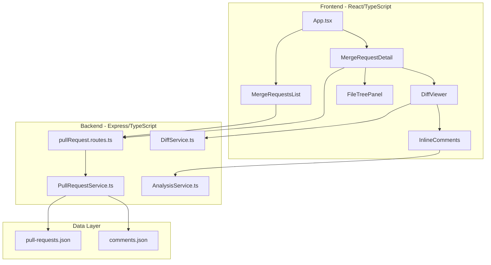

# GitLab Clone Implementation Plan

> **For Agent Continuity**: Read `gitlab-clone-progress.md` at the start of each session to resume work.

Transform Hellbender into a GitLab-like merge request interface with code diff views, inline AI comments, and proper tab navigation. All styling follows [`DESIGN.md`](../DESIGN.md) exactly.

---

## Architecture Overview

---

## Phase 1: Backend Foundation

### 1.1 Create PullRequestService
- File: `backend/src/services/PullRequestService.ts`
- Implement CRUD operations for pull requests using `backend/data/pull-requests.json`
- Methods: `getAll()`, `getById()`, `create()`, `updateStatus()`, `getComments()`, `addComment()`

### 1.2 Create DiffService for Git Operations
- File: `backend/src/services/DiffService.ts`
- Use `simple-git` to generate diffs between branches
- Parse diff output into structured format with line numbers
- Return: `{ filePath, additions, deletions, hunks[] }`

### 1.3 Register Pull Request Routes
- Update `backend/src/server.ts` to include PR routes
- Add: `app.use('/api/pull-requests', pullRequestRoutes);`

### 1.4 Create Comments Data Store
- File: `backend/data/comments.json`
- Structure: Array of Comment objects (line-specific AI comments)

---

## Phase 2: Frontend Types and Services

### 2.1 Add PR Types
- Update `frontend/src/types/api.types.ts`
- Add interfaces: `PullRequest`, `Comment`, `DiffHunk`, `DiffLine`, `FileChange`

### 2.2 Create PullRequestService (Frontend)
- File: `frontend/src/services/PullRequestService.ts`
- Methods: `getAll()`, `getById()`, `getComments()`, `addComment()`, `getDiff()`

### 2.3 Create usePullRequests Hook
- File: `frontend/src/hooks/usePullRequests.ts`
- State management for PR list, selected PR, loading states

### 2.4 Create useDiff Hook
- File: `frontend/src/hooks/useDiff.ts`
- Fetch and manage diff data for a PR

---

## Phase 3: Core UI Components

### 3.1 Create MergeRequestsList Component
- File: `frontend/src/components/MergeRequestsList.tsx`
- Display list of PRs with status badges (Open/Merged/Closed)
- Show author, branch info, time ago
- Clickable rows to select PR
- Style per DESIGN.md: `text-[10px] font-black uppercase tracking-widest`

### 3.2 Create FileTreePanel Component
- File: `frontend/src/components/FileTreePanel.tsx`
- Collapsible folder structure showing changed files
- Show +/- line counts per file (green/red)
- Checkbox for "Viewed" status
- Style: `bg-zinc-950/20`, `border-zinc-800`

### 3.3 Create DiffViewer Component
- File: `frontend/src/components/DiffViewer.tsx`
- Split or unified diff view
- Line numbers on left (old) and right (new)
- Color coding: green for additions, red for deletions
- Expandable context lines
- Style: `font-mono text-[11px]`, `bg-zinc-900/50`

### 3.4 Create DiffLine Component
- File: `frontend/src/components/DiffLine.tsx`
- Single line of diff with hover state
- Click to add comment icon
- Show existing comments inline
- Style: `hover:bg-zinc-800/50`

### 3.5 Create InlineComment Component
- File: `frontend/src/components/InlineComment.tsx`
- Display AI comment on specific line
- Show severity badge (Critical/High/Medium/Low)
- Collapsible content
- Style per DESIGN.md severity colors

---

## Phase 4: Merge Request Detail View

### 4.1 Refactor MergeRequestsView for Dynamic Data
- Update `frontend/src/components/MergeRequestsView.tsx`
- Replace mock data with real API calls
- Add proper tab content switching

### 4.2 Implement Overview Tab Content
- Show PR description, related issues
- Display activity timeline
- Show merge status and checks

### 4.3 Implement Commits Tab Content
- File: `frontend/src/components/CommitsTab.tsx`
- List commits in the PR
- Show commit hash, message, author, date
- Style: `font-mono`, commit hash in `text-primary`

### 4.4 Implement Changes Tab Content
- File: `frontend/src/components/ChangesTab.tsx`
- Two-panel layout: FileTreePanel (left) + DiffViewer (right)
- File count and +/- summary header
- "Compare" dropdown for branch selection

---

## Phase 5: AI Review Integration

### 5.1 Add AI Review Trigger Button
- "Request AI Review" button in PR detail header
- Calls existing analysis endpoint with PR files

### 5.2 Map Analysis Results to Line Comments
- Parse AI analysis issues with line numbers
- Convert to Comment objects with `filePath` and `line`
- Store via `/api/pull-requests/:id/comments`

### 5.3 Display AI Comments in DiffViewer
- Fetch comments when viewing diff
- Render InlineComment below relevant DiffLine
- Group multiple comments on same line

---

## Phase 6: Polish and UX

### 6.1 Add Loading States
- Skeleton loaders for PR list and diff view
- Use LoadingOverlay for analysis in progress

### 6.2 Add Keyboard Navigation
- Arrow keys to navigate files in tree
- `n`/`p` for next/previous comment
- `Escape` to close expanded comments

### 6.3 Add Responsive Behaviors
- Collapsible sidebar on smaller screens
- Mobile-friendly tab navigation

---

## Key Files Reference

| Purpose | Path |
|---------|------|
| Design System | `DESIGN.md` |
| Main App | `frontend/src/App.tsx` |
| Existing MR View | `frontend/src/components/MergeRequestsView.tsx` |
| CSS Variables | `frontend/src/index.css` |
| API Types | `frontend/src/types/api.types.ts` |
| PR Model | `backend/src/models/PullRequest.ts` |
| Comment Model | `backend/src/models/Comment.ts` |
| PR Routes | `backend/src/routes/pullRequest.routes.ts` |
| Server Entry | `backend/src/server.ts` |
