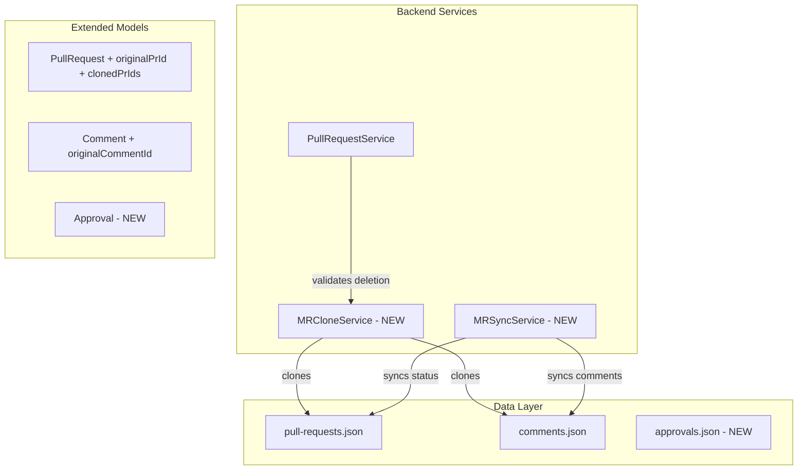
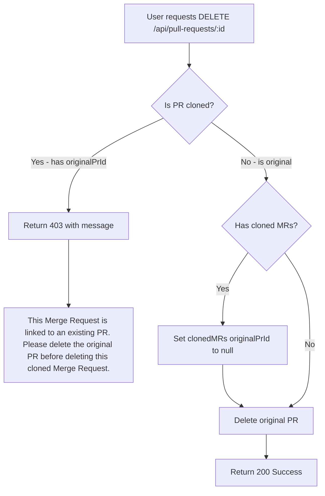

# Merge Request Clone Implementation Plan

> **For Agent Continuity**: Read `mr-clone-progress.md` at the start of each session to resume work.

Integrate Merge Request lifecycle rules into GitLab clone functionality. When a repository is cloned, associated MRs are cloned as logical references with enforced deletion constraints and status synchronization.

---

## Architecture Overview



---

## Deletion Flow



---

## Phase 1: Extend Data Models

### 1.1 Extend PullRequest Model
- File: `backend/src/models/PullRequest.ts`
- Add fields to PullRequest interface:
  - `originalPrId?: string` - Reference to the original PR (for clones)
  - `clonedPrIds?: string[]` - Array of cloned PR IDs (for originals)
  - `isCloned: boolean` - Quick check flag
- Preserve existing fields: sourceBranch, targetBranch, title, description, status, author, timestamps

### 1.2 Extend Comment Model
- File: `backend/src/models/Comment.ts`
- Add field: `originalCommentId?: string` - Reference to original comment for sync tracking
- Enable bidirectional comment synchronization

### 1.3 Create Approval Model
- File: `backend/src/models/Approval.ts` (NEW)
- Interface fields:
  - `id: string`
  - `prId: string`
  - `originalApprovalId?: string`
  - `approver: string`
  - `status: 'pending' | 'approved' | 'rejected'`
  - `createdAt: Date`
  - `updatedAt: Date`
- File: `backend/data/approvals.json` (NEW) - Empty array initially

---

## Phase 2: Create MR Clone Service

### 2.1 Create MRCloneService
- File: `backend/src/services/MRCloneService.ts` (NEW)
- Methods:
  ```typescript
  cloneMergeRequests(sourceRepoId: string, targetRepoId: string): Promise<PullRequest[]>
  cloneSingleMR(prId: string, targetRepoId: string): Promise<PullRequest>
  cloneComments(sourcePrId: string, targetPrId: string): Promise<Comment[]>
  cloneApprovals(sourcePrId: string, targetPrId: string): Promise<Approval[]>
  getLinkedMRs(prId: string): { original?: PullRequest; clones: PullRequest[] }
  isClonedMR(prId: string): boolean
  ```
- Clone logic:
  - Generate new UUID for cloned MR
  - Copy all fields except id
  - Set `originalPrId` to source PR id
  - Update source PR's `clonedPrIds` array
  - Set `isCloned: true` on clone

### 2.2 Integrate with RepositoryService
- File: `backend/src/services/RepositoryService.ts`
- Modify `clone()` method:
  - After successful git clone, check if source repo has associated MRs
  - Call `MRCloneService.cloneMergeRequests(sourceRepoId, newRepoId)`
  - Return cloned MR count in response
- Add method: `getSourceRepoId(repoUrl: string, branch: string): string | null`

---

## Phase 3: Implement Deletion Constraints

### 3.1 Add Deletion Validation
- File: `backend/src/services/PullRequestService.ts`
- Add method:
  ```typescript
  static delete(prId: string): { success: boolean; error?: string }
  ```
- Validation logic:
  1. Load PR by ID
  2. If `originalPrId` exists (is a clone): return error with message
  3. If `clonedPrIds` exists and not empty:
     - Set all cloned MRs' `originalPrId` to `null` (orphan them)
     - Remove from their `isCloned` flag or keep for history
  4. Delete PR and associated comments
  5. Return success

### 3.2 Add Delete Endpoint
- File: `backend/src/routes/pullRequest.routes.ts`
- Add route: `router.delete('/:id', PullRequestController.delete);`
- File: `backend/src/controllers/PullRequestController.ts`
- Add method:
  ```typescript
  static async delete(req: Request, res: Response) {
    const result = PullRequestService.delete(req.params.id);
    if (!result.success) {
      return res.status(403).json({ error: result.error });
    }
    res.json({ message: 'Pull Request deleted successfully' });
  }
  ```

### 3.3 Error Message Constant
- File: `backend/src/config/constants.ts`
- Add:
  ```typescript
  export const MR_DELETION_BLOCKED_MESSAGE =
    'This Merge Request is linked to an existing PR. Please delete the original PR before deleting this cloned Merge Request.';
  ```

---

## Phase 4: Implement Status Synchronization

### 4.1 Create MRSyncService
- File: `backend/src/services/MRSyncService.ts` (NEW)
- Methods:
  ```typescript
  syncStatus(prId: string, newStatus: 'open' | 'merged' | 'closed'): Promise<void>
  syncComments(prId: string): Promise<void>
  syncApprovals(prId: string): Promise<void>
  getSyncStatus(prId: string): { inSync: boolean; lastSynced?: Date }
  ```

### 4.2 Sync Status Logic
- When status changes on original:
  - Find all `clonedPrIds`
  - Update each clone's status to match
- When status changes on clone:
  - Find `originalPrId`
  - Update original's status
  - Propagate to all other clones
- Prevent infinite loops with sync flag

### 4.3 Hook Sync into PullRequestService
- File: `backend/src/services/PullRequestService.ts`
- Modify `updateStatus()`:
  ```typescript
  static updateStatus(id: string, status: 'open' | 'merged' | 'closed', skipSync = false): PullRequest | null {
    // ... existing logic ...
    if (!skipSync) {
      MRSyncService.syncStatus(id, status);
    }
    return prs[index];
  }
  ```

### 4.4 Comment Sync on Create
- Modify `addComment()`:
  - If PR is cloned (`originalPrId` exists), also create on original with `originalCommentId`
  - If PR is original (`clonedPrIds` exists), create on all clones
  - Pass `skipSync` flag to prevent recursion

---

## Phase 5: Frontend Integration

### 5.1 Update Frontend Types
- File: `frontend/src/types/api.types.ts`
- Extend PullRequest interface:
  ```typescript
  export interface PullRequest {
    // ... existing fields ...
    originalPrId?: string;
    clonedPrIds?: string[];
    isCloned: boolean;
  }
  ```
- Add Approval interface:
  ```typescript
  export interface Approval {
    id: string;
    prId: string;
    originalApprovalId?: string;
    approver: string;
    status: 'pending' | 'approved' | 'rejected';
    createdAt: Date | string;
    updatedAt: Date | string;
  }
  ```

### 5.2 Update PullRequestService (Frontend)
- File: `frontend/src/services/PullRequestService.ts`
- Add delete method:
  ```typescript
  async delete(prId: string): Promise<{ message: string }> {
    return this.delete<{ message: string }>(`/api/pull-requests/${prId}`);
  }
  ```
- Add method to ApiClient base class if `delete` HTTP method not present

### 5.3 Update MergeRequestsList Component
- File: `frontend/src/components/MergeRequestsList.tsx`
- Add clone indicator badge:
  - Show chain icon for linked MRs
  - Tooltip: "Cloned from PR-XXX" or "Has X clones"
- Add "View Original" link for cloned MRs
- Add delete button:
  - Disabled with tooltip for cloned MRs
  - Confirmation modal for original MRs

### 5.4 Update MergeRequestsView Component
- File: `frontend/src/components/MergeRequestsView.tsx`
- Add linked MR info in header section:
  - "Cloned from [Original PR Title]" with link
  - "Clones: [Clone 1], [Clone 2]" list
- Add sync status indicator badge
- Add manual "Sync Now" button

---

## Phase 6: Polish and UX

### 6.1 Add Error Handling
- Standardized error responses for all deletion/sync failures
- Toast notifications using existing UI patterns
- Graceful degradation if sync fails

### 6.2 Add Sync Status UI
- Show "Synced" badge (green) when in sync
- Show "Out of Sync" badge (orange) when diverged
- Show sync timestamp: "Last synced 5m ago"
- Manual sync trigger button

### 6.3 Add Keyboard Shortcuts
- `d` to open delete confirmation (if allowed)
- `s` to trigger manual sync

### 6.4 Add Tests
- File: `backend/src/__tests__/services/MRCloneService.test.ts`
- File: `backend/src/__tests__/services/MRSyncService.test.ts`
- Test cases:
  - Clone creates linked MR with correct fields
  - Delete blocked for cloned MR
  - Delete orphans clones when original deleted
  - Status sync propagates correctly
  - Comment sync works bidirectionally

---

## Key Files Reference

| Purpose | Path | Status |
|---------|------|--------|
| Implementation Plan | `plans/mr-clone-implementation.md` | This file |
| Progress Tracker | `plans/mr-clone-progress.md` | Companion file |
| Design System | `DESIGN.md` | Reference (do not modify) |
| PullRequest Model | `backend/src/models/PullRequest.ts` | Modify |
| Comment Model | `backend/src/models/Comment.ts` | Modify |
| Approval Model | `backend/src/models/Approval.ts` | NEW |
| Approvals Data | `backend/data/approvals.json` | NEW |
| MR Clone Service | `backend/src/services/MRCloneService.ts` | NEW |
| MR Sync Service | `backend/src/services/MRSyncService.ts` | NEW |
| PullRequest Service | `backend/src/services/PullRequestService.ts` | Modify |
| Repository Service | `backend/src/services/RepositoryService.ts` | Modify |
| PullRequest Controller | `backend/src/controllers/PullRequestController.ts` | Modify |
| PR Routes | `backend/src/routes/pullRequest.routes.ts` | Modify |
| Constants | `backend/src/config/constants.ts` | Modify |
| Frontend Types | `frontend/src/types/api.types.ts` | Modify |
| Frontend PR Service | `frontend/src/services/PullRequestService.ts` | Modify |
| Frontend ApiClient | `frontend/src/services/ApiClient.ts` | Modify |
| MR List Component | `frontend/src/components/MergeRequestsList.tsx` | Modify |
| MR View Component | `frontend/src/components/MergeRequestsView.tsx` | Modify |
| Clone Service Tests | `backend/src/__tests__/services/MRCloneService.test.ts` | NEW |
| Sync Service Tests | `backend/src/__tests__/services/MRSyncService.test.ts` | NEW |

---

## API Endpoints Summary

| Method | Endpoint | Description |
|--------|----------|-------------|
| GET | `/api/pull-requests` | List all PRs (existing) |
| GET | `/api/pull-requests/:id` | Get single PR (existing) |
| POST | `/api/pull-requests` | Create PR (existing) |
| PATCH | `/api/pull-requests/:id/status` | Update status (modify for sync) |
| DELETE | `/api/pull-requests/:id` | Delete PR (NEW - with constraints) |
| GET | `/api/pull-requests/:id/linked` | Get linked MRs (NEW) |
| POST | `/api/pull-requests/:id/sync` | Trigger manual sync (NEW) |
